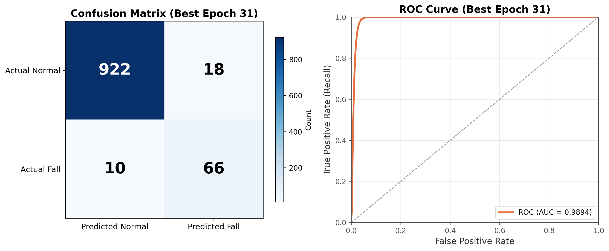

# 107维 BiLSTM 跌倒检测

基于 MediaPipe 姿态关键点的 BiLSTM+Attention 跌倒检测模型，使用 URFD 和 Le2i 数据集训练。

## 模型架构

- **输入**：107 维特征 = 99 维姿态关键点 + 4 维速度特征(C) + 4 维稳定性特征(E)
- **模型**：2 层双向 LSTM (hidden=128) + 注意力池化 + 分类头
- **窗口大小**：30 帧
- **训练策略**：80/20 划分，加权随机采样，ReduceLROnPlateau 学习率调度

## 实验结果

| 指标 | 数值 |
|------|------|
| Accuracy | 97.24% |
| AUC | 0.9894 |
| Fall Recall | 86.84% |
| Fall Precision | 78.57% |
| Fall F1 | 82.50% |
| FPR | 1.91% |

**混淆矩阵**：TN=922, FP=18, FN=10, TP=66



## 环境配置

```bash
pip install -r requirements.txt
```

### 依赖说明

| 包 | 用途 |
|------|------|
| `torch` | LSTM 模型训练与推理 |
| `numpy` | 数值计算 |
| `opencv-python` | 视频读写、图像处理 |
| `scikit-learn` | 数据划分、评估指标 |
| `matplotlib` | 训练曲线绘制 |
| `mediapipe` | 姿态关键点提取（demo 推理用） |

## 数据准备

训练需要以下 `.npy` 文件，放置在 `data/` 目录下：

```
data/
├── urfd_X_99.npy    # URFD 数据集 99 维关键点窗口
├── urfd_y.npy       # URFD 标签
├── le2i_X_99.npy    # Le2i 数据集 99 维关键点窗口
└── le2i_y.npy       # Le2i 标签
```

数据格式：`(N, 30, 99)` 的 float32 数组，每个窗口为 30 帧 x 33 个关键点 x 3 坐标。

## 训练

```bash
python train_107_8020.py
```

训练输出：
- `fall_lstm_107_best.pt` — 最佳模型权重
- `results_107.json` — 测试集评估结果
- `training_curves.png` — 训练曲线图
- `csv/training_history.csv` — 逐 epoch 指标
- `norm_mean.npy` / `norm_std.npy` — 归一化参数

## Demo 视频

`annotated_cn_Coffee_room_01_video_(1).mp4` 为中文标注的推理演示视频（Coffee_room_01 场景）。

## 文件说明

| 文件 | 说明 |
|------|------|
| `train_107_8020.py` | 训练主脚本 |
| `pose_extractor.py` | MediaPipe 姿态提取器 |
| `feature_engine.py` | 21 维手工特征计算 |
| `anatomical_features.py` | 解剖学特征计算 |
| `visualizer.py` | 标注可视化 |
| `fall_lstm_107_best.pt` | 最佳模型权重 (2.6MB) |
| `results_107.json` | 测试评估结果 |

## 引用

- 数据集：URFD (University of Rzeszow Fall Detection) + Le2i Fall Detection Dataset
- 姿态提取：Google MediaPipe Pose
